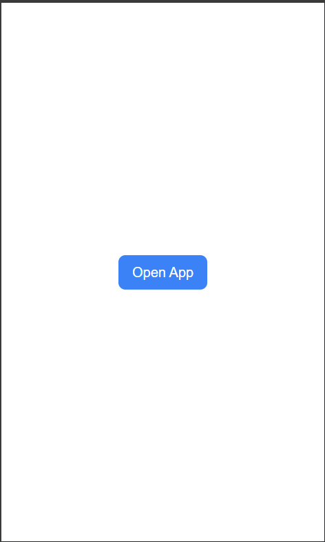
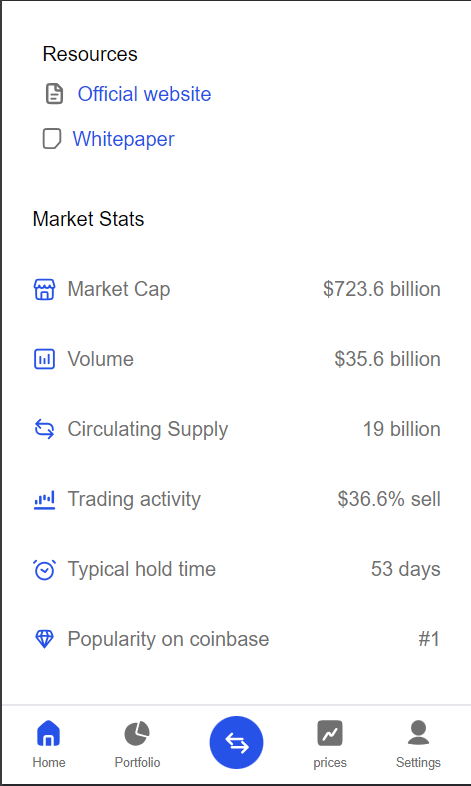

## Memecoins React App with Vite & Tailwind CSS

This project is a React application built with Vite for development and Tailwind CSS for styling. It allows you to explore the world of memecoins (fictional cryptocurrencies inspired by internet memes).

### Features

* Browse through various memecoins with their details.
* (Add more features specific to your application here)


### Adding UI pics:
## image one

## image second

## image third

### Prerequisites

* Node.js and npm (or yarn) installed on your system. You can check by running `node -v` and `npm -v` (or `yarn -v`) in your terminal.

### Installation

1. Clone this repository:

```bash
git clone (https://github.com/tuwid-Ashish/memecoins.git)

cd memecoins
npm install  # or yarn install
npm run dev  # or yarn dev
